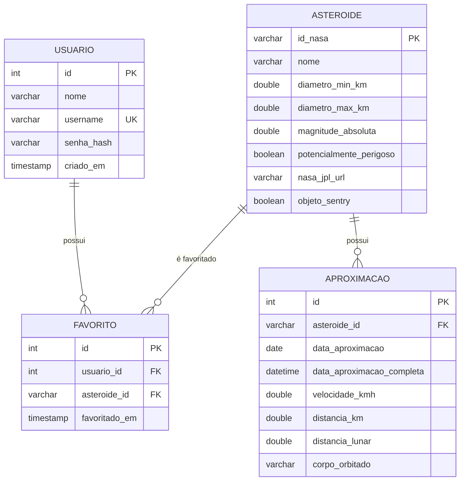

# DER — AstroWatch

```mermaid
erDiagram

    USUARIO {
        int id PK
        varchar nome
        varchar username UK
        varchar senha_hash
        timestamp criado_em
    }

    ASTEROIDE {
        varchar id_nasa PK
        varchar nome
        double diametro_min_km
        double diametro_max_km
        double magnitude_absoluta
        boolean potencialmente_perigoso
        varchar nasa_jpl_url
        boolean objeto_sentry
    }

    APROXIMACAO {
        int id PK
        varchar asteroide_id FK
        date data_aproximacao
        datetime data_aproximacao_completa
        double velocidade_kmh
        double distancia_km
        double distancia_lunar
        varchar corpo_orbitado
    }

    FAVORITO {
        int id PK
        int usuario_id FK
        varchar asteroide_id FK
        timestamp favoritado_em
    }

    USUARIO ||--o{ FAVORITO : "possui"
    ASTEROIDE ||--o{ FAVORITO : "é favoritado"
    ASTEROIDE ||--o{ APROXIMACAO : "possui"
```
